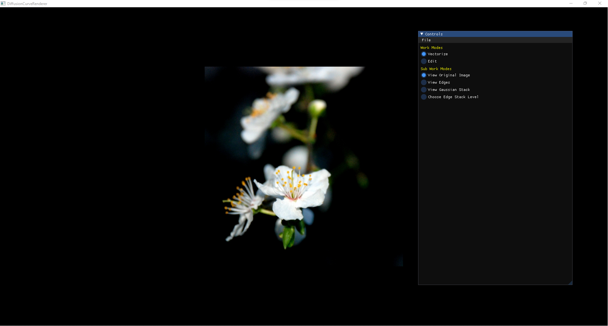
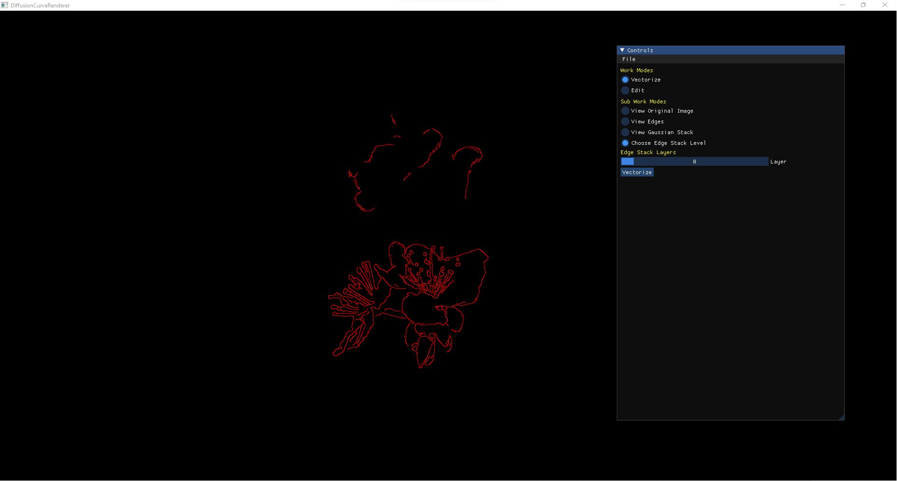
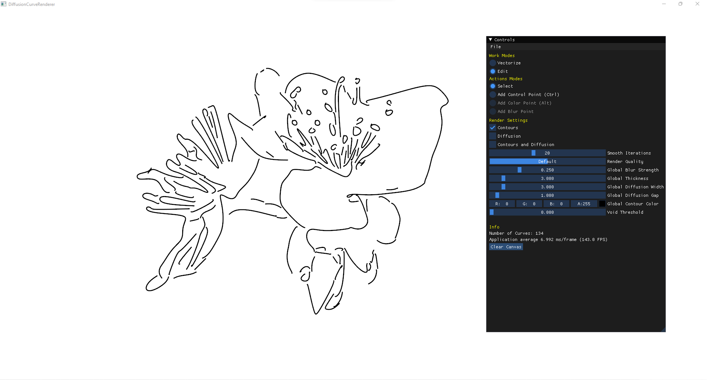
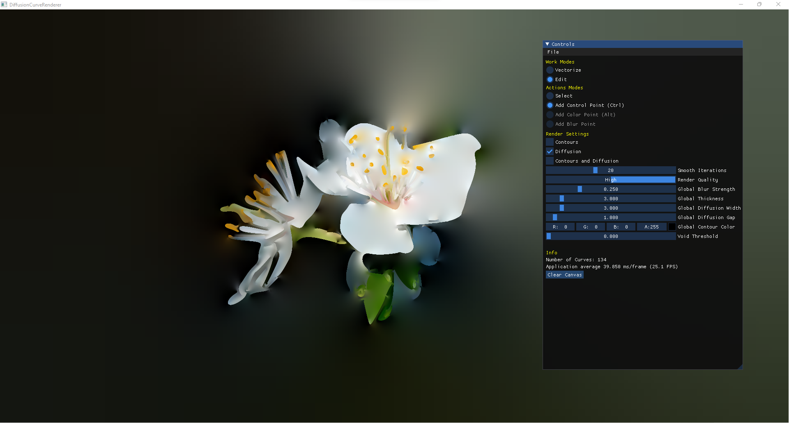

# Diffusion Curve Renderer
Reconstructing images using Bezier curves and diffusing colors constrained by those curves.

If you do not want to import an image to the application in order to run the vectorization pipeline, you can use edit mode to create artistic images from scratch.

The ideas belong to [Orzan et al.](https://hal.archives-ouvertes.fr/inria-00274768/)

I took vectorization algorithms from this [repo](https://hal.archives-ouvertes.fr/inria-00274768/) and adopted.

Vectorization algorithms run on CPU but the diffusion algorithm runs on GPU providing real time editing.

The project is developed using OpenGL, OpenCV, Eigen, ImGui and Qt framework and is written in C++.

## Dependencies
This project has 3 dependencies and all of them is under `Dependencies` folder.
I use ImGui for GUI; OpenCV for edge detecetion and Eigen for vectorization.
OpenCV's binaries were built with `MSVC2019 64bit` compiler.

## Build
Simply open `DiffusionCurveRenderer.pro` with `Qt Creator` and build it with kit `Qt 6.3.0 MSVC2019 64bit`. OpenCV's dlls should be put under the folder where the executable resides. Then you can run the application.

## Screenshots

